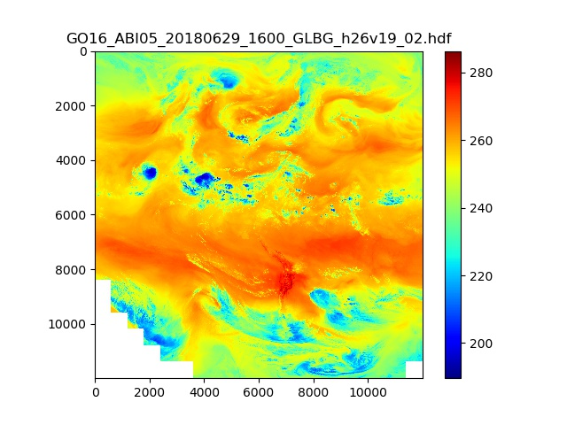

# GeoNEX Utilities

This repository can be used to share scripts related to the GeoNEX data products. 

Dependencies:
- python 3
- pyhdf
- numpy
- pandas
- matplotlib
- scipy

## GeoNEXL1G Basic Tests

- Make composite images for each band
- Compute general statistics from a random sample of files
- Count the number of (day, year) pairs for each tile. This gives an idea if certain tiles failed to process.

Example command:  
`python geonexl1g_data_test.py --data_path /nex/datapool/geonex/public/GOES16/GEONEX-L1B/ --output_path  ./data_statistics/GOES16/ --sensor GOES16 --samples 50`

Sample composite image of Band 10  

